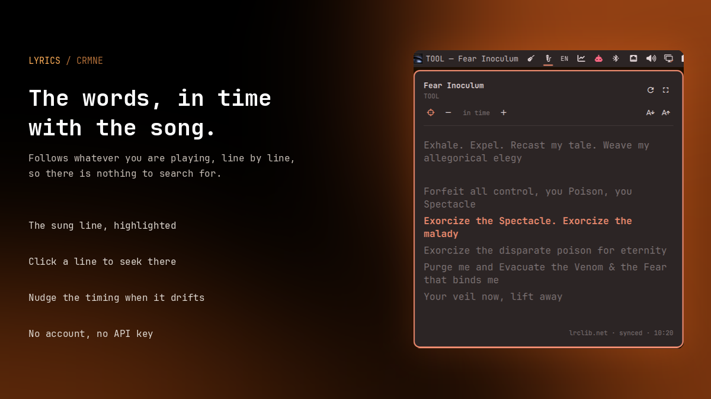

# Lyrics Synced with Music

The words to whatever is already playing, in time with the song.

The widget picks up whatever you are playing and looks it up on
[LRCLIB](https://lrclib.net) — so there is nothing to search for, and no
account to make. When the track has synced lyrics, the line being sung is
highlighted and the panel follows along; click any line to jump the player
there.



`microphone icon` · `follows the song` · `click a line to seek` · `timing nudge` · `text size`

## Install

```bash
omarchy plugin add https://github.com/crmne/omarchy-lyrics.git --enable --yes
omarchy bar move crmne.lyrics --section right --before omarchy.tray
```

## Requirements

- Omarchy Quattro with its Quickshell-based shell.
- Any media player that tells the desktop what it is playing (the standard
  MPRIS interface, which nearly all of them speak).
- `/usr/bin/python3` for the fetch helper. No extra packages, no account.

## Using it

| Action | What it does |
|---|---|
| left click | open the lyrics |
| middle click | look them up again, ignoring the cache |

Inside the panel: click a line to seek there, nudge the timing when an upload
runs early or late, step the text size, or expand the panel. Scrolling by hand
stops it following; the crosshair button picks the song back up. Text size,
expanded state, and the timing nudge are remembered in
`~/.local/state/omarchy/settings/lyrics.json`.

Expanding is a step up in size rather than a takeover of the screen, and it
leaves the text alone: lyrics are already large, and the size is yours to set.

While a track is playing before its first line -- an intro, or a song started
again after it finished -- there is no line to highlight, so the panel returns
to the top instead of sitting wherever it was left. Lyrics that came without
timestamps get scrolled to roughly where the track is, which is the best guess
available without them.

When a track has no lyrics the panel says so. LRCLIB also marks tracks it knows
are instrumental, and those say that instead.

The panel opens under the widget and slides to stay on screen, so a bar icon on
the right opens a panel on the right.

## How the track is matched

What a player reports rarely matches a database exactly, so the plugin asks
LRCLIB for an exact match on artist, title, album and duration first, and only
widens to a search if that misses.

Track length decides between candidates, because a search for a well-known title
returns the same words attached to several different recordings — studio, live,
and other people's songs of the same name. A candidate more than 30 seconds away
from what is playing is refused rather than shown, and synced lyrics win a tie
against plain ones.

## IPC

```bash
omarchy-shell crmne.lyrics status     # what is playing, and what was found
omarchy-shell crmne.lyrics toggle     # open or close the panel
omarchy-shell crmne.lyrics show       # open the panel
omarchy-shell crmne.lyrics hide       # close the panel
omarchy-shell crmne.lyrics refresh    # look the lyrics up again
```

Bind `toggle` to a key in `~/.config/hypr/bindings.conf` to summon the panel
without reaching for the bar.

## Remove

```bash
omarchy plugin remove crmne.lyrics --yes
```

## Development

Put or link this repository at `~/.config/omarchy/plugins/crmne.lyrics` and run:

```bash
omarchy-shell shell rescanPlugins
omarchy plugin enable crmne.lyrics --section right --before omarchy.tray
```

Saving any file under `~/.config/omarchy/plugins/` reloads the plugin.

The fetch helper is usable on its own:

```bash
bin/lrclib get --artist "Artist" --title "Song" --duration 240
bin/lrclib search --artist "Artist" --title "Song"
```

Matching, LRC parsing, and the current-line lookup live in `Model.js` as pure
functions:

```bash
node --test tests/model.test.js
```

Responses are cached under `~/.cache/omarchy/lyrics` for a month, since lyrics
do not change. Pass `--no-cache` to bypass it.

## License

MIT for the plugin. Lyrics belong to their writers and publishers; LRCLIB is the
source and this is only a reader for it.
